# Real Estate Price Prediction System
## Enterprise-Grade ML Application with Automated Web Data Extraction

---

## Executive Summary

This system represents a production-ready machine learning application designed to predict apartment prices in the Russian real estate market. The architecture combines gradient boosting regression (CatBoost), intelligent web scraping with anti-detection mechanisms, and a modern web interface to deliver accurate price predictions from both manual input and automated URL-based data extraction.

**Domain Context**: The Russian real estate market, particularly new construction developments, presents unique challenges for price prediction due to complex categorical features (building class, developer reputation, district characteristics) and the dynamic nature of online listings across multiple platforms (Samolet.ru, Cian.ru).

**Core Value Proposition**: Automated extraction and prediction pipeline that transforms unstructured web data into actionable price insights with minimal user intervention.

---

## Table of Contents

1. [Problem Statement & Objectives](#problem-statement--objectives)
2. [System Architecture](#system-architecture)
3. [Technical Design Principles](#technical-design-principles)
4. [Component Specifications](#component-specifications)
5. [Data Extraction Architecture](#data-extraction-architecture)
6. [Machine Learning Pipeline](#machine-learning-pipeline)
7. [Deployment & Operations](#deployment--operations)
8. [Example Usage Scenarios](#example-usage-scenarios)
9. [Limitations & Safety Considerations](#limitations--safety-considerations)
10. [Future Enhancements](#future-enhancements)

---

## Problem Statement & Objectives

### Business Problem

Real estate price estimation requires analyzing numerous interdependent features including:
- **Spatial attributes**: District, proximity to infrastructure
- **Building characteristics**: Construction class, developer reputation, building type
- **Unit specifications**: Floor position, total area, layout configuration
- **Temporal factors**: Construction phase, delivery timeline

Manual data entry is error-prone and time-consuming. Existing solutions lack integration with live property listings.

### Technical Objectives

1. **Automated Data Acquisition**: Extract structured property data from unstructured HTML/JavaScript sources
2. **Robust Prediction**: Handle missing features gracefully while maintaining prediction accuracy
3. **Multi-Platform Support**: Unified extraction logic for heterogeneous website architectures
4. **Production Reliability**: Anti-detection mechanisms, error recovery, and comprehensive logging

### Scope

**In Scope**:
- New construction apartments in Russian market
- Samolet.ru and Cian.ru listing platforms
- Price-per-square-meter and total price predictions
- Bilingual interface (English/Russian)

**Out of Scope**:
- Secondary market (resale) properties
- Commercial real estate
- Historical price trend analysis
- Automated retraining pipeline

---

## System Architecture

### High-Level Architecture


### Technology Stack

| Layer | Technology | Justification |
|-------|-----------|---------------|
| **Frontend** | React 18 + Vite | Fast HMR, modern JSX transform, optimal bundle size |
| **API Server** | FastAPI 0.100+ | Async support, automatic OpenAPI docs, Pydantic validation |
| **ML Framework** | CatBoost | Superior categorical feature handling, built-in regularization |
| **Web Scraping** | Selenium + BeautifulSoup4 | JavaScript execution, anti-bot evasion, flexible parsing |
| **Driver Management** | webdriver-manager | Automatic ChromeDriver version matching |
| **HTTP Client** | Axios | Promise-based, request/response interceptors |

---

## Technical Design Principles

### 1. **Graceful Degradation**

The system employs a **3-tier extraction strategy** where each method compensates for the failures of previous methods:

```
Tier 1: JavaScript JSON Extraction (window.__NEXT_DATA__, window._cianConfig)
   ↓ (if fails)
Tier 2: BeautifulSoup HTML Parsing (CSS selectors, DOM traversal)
   ↓ (if fails)
Tier 3: Regex Text Extraction (pattern matching on visible text)
```

**Rationale**: Modern websites use diverse rendering strategies (SSR, CSR, hybrid). A single extraction method cannot reliably handle all cases.

### 2. **Anti-Detection Architecture**

> [!IMPORTANT]
> Web scraping must appear indistinguishable from human browsing to avoid IP blocking and CAPTCHA challenges.

**Implementation**:
```python
options.add_argument('--disable-blink-features=AutomationControlled')
options.add_experimental_option("excludeSwitches", ["enable-automation"])
driver.execute_script("Object.defineProperty(navigator, 'webdriver', {get: () => undefined})")
```

**Techniques**:
- Custom user-agent strings mimicking Chrome 120+
- Removal of automation flags from `navigator` object
- Randomized wait times (currently fixed at 5s, configurable)
- Headless mode for server deployment

### 3. **Feature Engineering Consistency**

> [!WARNING]
> Prediction accuracy degrades significantly if feature names or categorical encodings differ between training and inference.

**Safeguards**:
- Centralized feature schema (`model_features.json`)
- Explicit categorical feature list (`categorical_features.json`)
- Russian-to-English field mapping with validation
- Missing value imputation with domain-specific defaults

### 4. **Separation of Concerns**

Each component has a single, well-defined responsibility:

- **Extraction Layer**: Raw data acquisition (no business logic)
- **Mapping Layer**: Field normalization (no prediction logic)
- **Preparation Layer**: Feature engineering (no extraction logic)
- **Model Layer**: Inference only (no data processing)

---

## Component Specifications

### Backend API (`backend/main.py`)

**Endpoints**:

#### `POST /predict`
Manual prediction from user-provided features.

**Request Schema**:
```json
{
  "data": {
    "TotalArea": 85.5,
    "Floor": 12,
    "FloorsTotal": 25,
    "Building": "3",
    "Section": "2",
    "PropertyType": "3-комнатная"
  }
}
```

**Response Schema**:
```json
{
  "predicted_price_per_meter": 245000.50,
  "estimated_total_price": 20947542.75
}
```

#### `POST /predict-from-link`
Automated extraction and prediction from URL.

**Request Schema**:
```json
{
  "url": "https://www.cian.ru/sale/flat/325897227/"
}
```

**Response Schema**: Same as `/predict`

**Error Handling**:
- `400 Bad Request`: Invalid URL or unsupported domain
- `500 Internal Server Error`: Extraction failure, model error, or insufficient data

> [!NOTE]
> Currently supports `cian.ru` and `samolet.ru` domains. Additional platforms require pattern updates in extraction logic.

### Frontend Application (`frontend/src/`)

**Architecture**: Single-page application with component-based design

**Key Features**:
- **Input Mode Toggle**: Switch between manual form and URL input
- **Bilingual Support**: English/Russian with persistent localStorage preference
- **Dark Mode**: Theme toggle with CSS variable-based styling
- **Responsive Design**: Mobile-first CSS Grid/Flexbox layout
- **Error Boundaries**: User-friendly error messages with backend error passthrough

**State Management**:
```javascript
// Core application state
const [language, setLanguage] = useState('en')
const [theme, setTheme] = useState('light')
const [inputType, setInputType] = useState('manual')
const [formData, setFormData] = useState({...})
const [linkUrl, setLinkUrl] = useState('')
const [prediction, setPrediction] = useState(null)
```

---

## Data Extraction Architecture

### Extraction Pipeline

```mermaid
sequenceDiagram
    participant API as FastAPI Endpoint
    participant Driver as Selenium WebDriver
    participant Page as Target Website
    participant Extractor as Extraction Logic
    participant Mapper as Field Mapper
    
    API->>Driver: Initialize with anti-detection config
    Driver->>Page: GET request with custom headers
    Page-->>Driver: HTML + JavaScript response
    Driver->>Driver: Wait 5s for JS execution
    
    Driver->>Extractor: Execute JS to extract window.__NEXT_DATA__
    alt JSON data found
        Extractor->>Extractor: Apply 20+ regex patterns
        Extractor-->>Mapper: Extracted fields (Russian)
    else JSON extraction failed
        Driver->>Extractor: Parse HTML with BeautifulSoup
        Extractor->>Extractor: CSS selector matching
        Extractor-->>Mapper: Extracted fields (Russian)
    end
    
    alt HTML extraction insufficient
        Driver->>Extractor: Get page.text
        Extractor->>Extractor: Regex pattern matching
        Extractor-->>Mapper: Additional fields (Russian)
    end
    
    Mapper->>Mapper: Translate to English field names
    Mapper->>Mapper: Clean numeric values (remove "м²")
    Mapper-->>API: Normalized feature dict
```



### Method 1: JavaScript JSON Extraction

**Objective**: Access internal application state before DOM rendering.

**Targets**:
- `window.__NEXT_DATA__` (Next.js applications)
- `window._cianConfig` (Cian.ru specific)
- `window.__INITIAL_STATE__` (Redux/legacy apps)
- `<script type="application/json">` tags with React props

**Advantages**:
- Complete data access (including non-visible fields)
- Immune to CSS class name changes
- Fastest extraction method

**Limitations**:
- Requires JavaScript execution (Selenium overhead)
- Website-specific variable names

### Method 2: BeautifulSoup HTML Parsing

**Objective**: Extract visible structured data from rendered HTML.

**Selectors**:
```python
param_items = soup.select('li[class*="cui-wzd2b5"], div[class*="c6c5c8b1"]')
```

**Pattern**: Label-value pairs separated by newlines
```
Общая площадь
85.5 м²
```

**Advantages**:
- Works when JavaScript data is unavailable
- Reliable for static content

**Limitations**:
- Fragile to CSS class changes
- Requires exact selector maintenance

### Method 3: Regex Text Extraction

**Objective**: Fallback extraction from visible page text.

**Patterns**:
```python
patterns = {
    'Застройщик (Код)': r'Застройщик[:\s]+([^\n]+)',
    'Общая Площадь': r'Общая площадь[:\s]+([\d\.,]+\s*м²)'
}
```

**Advantages**:
- Most resilient to website changes
- No dependency on DOM structure

**Limitations**:
- Prone to false positives
- Requires careful pattern design

### Field Mapping

**Russian to English Translation**:
```python
field_mapping = {
    'Общая Площадь': 'TotalArea',
    'Этаж': 'Floor',
    'Всего Этажей': 'FloorsTotal',
    'Застройщик (Код)': 'Developer_encoded',
    'Комплекс (Код)': 'Complex_encoded',
    # ... 25+ additional mappings
}
```

**Numeric Cleaning**:
```python
# "85.5 м²" → 85.5
match = re.search(r'(\d+[.,]?\d*)', value)
cleaned = float(match.group(1).replace(',', '.'))
```

---

## Machine Learning Pipeline

### Model Architecture

**Algorithm**: CatBoost Gradient Boosting
- **Trees**: 1000 iterations
- **Depth**: 6 (prevents overfitting on categorical features)
- **Learning Rate**: 0.03
- **Loss Function**: RMSE (log-transformed target)

> [!TIP]
> **Why CatBoost?**
> We chose CatBoost because our dataset contains many high-cardinality categorical features (District, Developer, Complex), and CatBoost handles these natively using **Ordered Target Encoding**. This eliminates the need for manual one-hot encoding, prevents target leakage, and delivers more stable performance on structured tabular data compared to LightGBM or XGBoost.

**Feature Categories**:

| Category | Examples | Encoding |
|----------|----------|----------|
| **Numeric** | TotalArea, Floor, CeilingHeight | Direct float |
| **Ordinal** | FloorsTotal, Building, Section | Integer |
| **Categorical** | Developer_encoded, Complex_encoded, Class | CatBoost native encoding |

**Target Variable**: `log(price_per_sqm)`
- **Rationale**: Price distributions are log-normal; log transform stabilizes variance

### Feature Preparation

```python
def prepare_input_dataframe(data: dict) -> pd.DataFrame:
    """
    Converts raw input dict to model-ready DataFrame.
    
    Handles:
    - Missing features (filled with None)
    - Feature ordering (must match training schema)
    - Categorical type casting
    """
    df = pd.DataFrame([{feat: data.get(feat) for feat in feature_list}])
    df[categorical_features] = df[categorical_features].astype(str)
    return df
```

> [!IMPORTANT]
> CatBoost requires categorical features to be explicitly declared. Failure to do so results in treating categories as numeric, severely degrading accuracy.

### Prediction Flow

```python
# 1. Prepare features
input_df = prepare_input_dataframe(mapped_data)

# 2. Predict (log-space)
pred_log = model.predict(input_df)

# 3. Inverse transform
price_per_meter = float(np.exp(pred_log)[0])

# 4. Calculate total price
total_price = price_per_meter * total_area
```

---

## Deployment & Operations

### Backend Deployment

**Requirements**:
```bash
pip install -r backend/requirements.txt
```

**Dependencies**:
- `fastapi` - API framework
- `uvicorn` - ASGI server
- `catboost` - ML model
- `selenium` - Web automation
- `beautifulsoup4` - HTML parsing
- `webdriver-manager` - ChromeDriver management

**Launch**:
```bash
cd backend
uvicorn main:app --host 0.0.0.0 --port 8000 --reload
```

**Production Considerations**:
- Use `--workers 4` for multi-process serving
- Set `--reload` to `False` in production
- Configure reverse proxy (Nginx) for SSL termination
- Implement rate limiting to prevent scraping abuse

### Frontend Deployment

**Build**:
```bash
cd frontend
npm install
npm run build
```

**Output**: `frontend/dist/` (static files)

**Serving Options**:
1. **Static hosting**: Netlify, Vercel, GitHub Pages
2. **CDN**: CloudFront, Cloudflare
3. **Containerized**: Nginx Docker image

**Environment Configuration**:
```javascript
// Update API base URL in App.jsx
const API_URL = process.env.VITE_API_URL || 'http://localhost:8000'
```

### Monitoring & Logging

**Backend Logs**:
```
🚀 Loading: https://www.cian.ru/sale/flat/325897227/
🔍 Method 1: Extracting internal JSON data...
   ✅ Found 15 fields from JSON
🔍 Method 2: Extracting HTML data...
   ✅ Found 3 additional fields from HTML
🔍 Method 3: Scanning page text...
   ✅ Found 1 additional fields from text
📊 EXTRACTION COMPLETE: 19 total fields found
```

**Metrics to Track**:
- Extraction success rate per method
- Average extraction time
- Prediction latency (p50, p95, p99)
- Error rate by error type

---

## Example Usage Scenarios

### Scenario 1: Manual Price Estimation

**Use Case**: User has property details from offline source (brochure, agent)

**Workflow**:
1. Select "Manual Input" mode
2. Fill form fields (Total Area, Floor, etc.)
3. Submit form
4. Receive instant prediction

**Expected Latency**: <100ms (model inference only)

### Scenario 2: URL-Based Prediction (Cian.ru)

**Use Case**: User browsing Cian.ru finds interesting listing

**Workflow**:
1. Copy listing URL: `https://www.cian.ru/sale/flat/325897227/`
2. Select "Link Input" mode
3. Paste URL and submit
4. System extracts 15-25 features automatically
5. Receive prediction with extracted details

**Expected Latency**: 8-12 seconds (5s page load + 3s extraction + <1s inference)

### Scenario 3: Comparative Analysis

**Use Case**: Compare multiple listings across platforms

**Workflow**:
1. Extract data from Samolet.ru listing → Prediction A
2. Extract data from Cian.ru listing → Prediction B
3. Compare price-per-sqm to identify overpriced/underpriced units

**Insight**: Listings with >15% deviation from predicted price warrant further investigation

---

## Limitations & Safety Considerations

### Technical Limitations

> [!WARNING]
> **Model Scope**: Trained exclusively on new construction data. Predictions for secondary market properties will be unreliable.

1. **Supported Platforms**: Only Cian.ru and Samolet.ru
   - **Mitigation**: Extraction patterns are modular; new platforms require adding CSS selectors and regex patterns
   - **Note**: Protected websites (Domclick.ru, Avito.ru) implement advanced anti-bot measures (CAPTCHA, fingerprinting, rate limiting) that require additional infrastructure (residential proxies, CAPTCHA solving services, browser fingerprint randomization) beyond the current implementation

2. **Anti-Bot Measures**: Websites may implement CAPTCHA or IP blocking
   - **Mitigation**: Randomized delays, residential proxies (not implemented), CAPTCHA solving services (not implemented)

3. **Feature Availability**: Not all listings contain all features
   - **Mitigation**: CatBoost handles missing values natively; prediction confidence decreases with missing data

4. **Model Staleness**: Real estate market dynamics change over time
   - **Mitigation**: Periodic retraining required (not automated)

### Safety & Ethical Considerations

> [!CAUTION]
> **Web Scraping Legality**: Ensure compliance with website Terms of Service and local regulations (e.g., GDPR, CCPA).

**Recommendations**:
- Implement rate limiting (max 10 requests/minute)
- Add `robots.txt` compliance checking
- Respect `noindex` meta tags
- Provide clear attribution in UI

**Data Privacy**:
- No user data is stored server-side
- Predictions are stateless (no logging of input data)
- Consider adding user consent for URL-based extraction

### Performance Constraints

**Selenium Overhead**:
- Each URL extraction spawns a new Chrome instance
- Memory usage: ~200-300MB per request
- **Recommendation**: Implement request queuing for concurrent requests

**Scalability**:
- Current architecture: Single-threaded extraction
- **Bottleneck**: ChromeDriver process creation
- **Solution**: Selenium Grid for distributed scraping

---

## Future Enhancements

### Short-Term (1-3 months)

1. **Caching Layer**: Redis cache for recently extracted URLs (TTL: 24h)
2. **Async Extraction**: FastAPI background tasks for non-blocking URL processing
3. **Confidence Intervals**: Return prediction uncertainty based on feature completeness
4. **Enhanced Anti-Detection**: Browser fingerprint randomization, residential proxy rotation

> [!NOTE]
> Expansion to heavily protected platforms (Domclick.ru, Avito.ru) requires significant infrastructure investment including CAPTCHA solving services, residential proxy networks, and advanced fingerprinting techniques, which are beyond the scope of this MVP.

### Medium-Term (3-6 months)

1. **Model Versioning**: A/B testing framework for model updates
2. **Feature Store**: Centralized feature repository with versioning
3. **Automated Retraining**: Scheduled model updates with new data
4. **User Feedback Loop**: "Report Incorrect Prediction" mechanism

### Long-Term (6-12 months)

1. **Multi-Model Ensemble**: Combine CatBoost, XGBoost, LightGBM predictions
2. **Time-Series Integration**: Incorporate historical price trends
3. **Geospatial Features**: Distance to metro, schools, parks (requires geocoding API)
4. **Mobile Application**: React Native app with camera-based form filling (OCR)

---

## Technical Documentation

### API Documentation

Interactive API docs available at:
- **Swagger UI**: `http://localhost:8000/docs`
- **ReDoc**: `http://localhost:8000/redoc`

### Model Training

Training notebook: `notebook/model_training.ipynb`

**Dataset**: `dataset/samolet_flats.csv`
- **Rows**: ~50,000 apartment listings
- **Features**: 30+ (numeric, categorical, ordinal)
- **Target**: Price per square meter (RUB)

**Training Metrics**:
- **RMSE**: 15,000 RUB/sqm
- **MAE**: 10,500 RUB/sqm
- **R²**: 0.89

### Repository Structure

```
.
├── backend/
│   ├── main.py                          # FastAPI application
│   ├── catboost_price_model_final.cbm   # Trained model
│   ├── model_features.json              # Feature schema
│   ├── categorical_features.json        # Categorical feature list
│   └── requirements.txt                 # Python dependencies
├── frontend/
│   ├── src/
│   │   ├── App.jsx                      # Main React component
│   │   └── App.css                      # Styling
│   ├── package.json                     # Node dependencies
│   └── vite.config.js                   # Build configuration
├── notebook/
│   └── model_training.ipynb             # Training pipeline
├── dataset/
│   └── samolet_flats.csv                # Training data
└── README.md                            # This file
```

---

## License & Attribution

**Model**: Proprietary (trained on publicly available data)
**Code**: MIT License (see LICENSE file)

**Third-Party Libraries**:
- CatBoost: Apache 2.0
- FastAPI: MIT
- React: MIT
- Selenium: Apache 2.0

---

## Contact & Support

**Author**: Dheeraj Varma
**Portfolio**: [GitHub Profile](https://github.com/Dheerajvarma1)
**Project Repository**: [Samolet-Russia](https://github.com/Dheerajvarma1/Predicting-Apartment-Prices-from-Layout-Characteristics)

**Issues**: Please report bugs via GitHub Issues with:
- Error logs (backend console output)
- Browser console errors (frontend)
- Example URL (if extraction-related)
- Expected vs. actual behavior

---

**Last Updated**: February 2026
**Version**: 5.0
**Status**: Production-Ready
